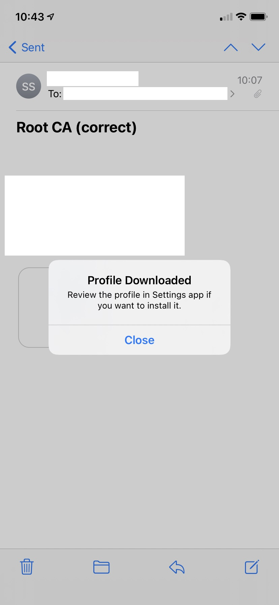

# Generate self-signed certificates issued by a custom Root Certification Authority

This procedure allows to created self-signed certificates issued by a custom Root Certification Authority (Root CA). The certificates emitted will contain Subject Alternate Names (SAN) containing the IP address of the machine hosting the web application (which expose the certificate). This is required for the constraints of some projects, where there's an intranet server setup, with no DNS possibility.


## Creating the Root CA and the server certificate

This procedure is partly based on https://gist.github.com/fntlnz/cf14feb5a46b2eda428e000157447309

### Create Root Key
```
openssl genrsa -des3 -out rootCA.key 4096`
```

### Create and self sign the Root Certificate
```
openssl req -x509 -new -nodes -key rootCA.key -sha256 -days 1024 -out rootCA.crt
```


### Generate certificate signing request
```
openssl req -new -sha256 -key floreffe.happli.be.key -config san.cnf -out floreffe.happli.be.csr
```

### Sign the certificate
```
openssl x509 -req -in floreffe.happli.be.csr -CA rootCA.crt -CAkey rootCA.key -CAcreateserial -out floreffe.happli.be.crt -days 824 -sha256 -extfile san.cnf -extensions v3_req
```
__!!Warning!!__ The number of days should not exceed 825 (see https://support.apple.com/en-us/HT210176).

### san.cnf file content
This file contains the IP address of the server. It should be replaced for every new setup, and the IP address of the server should be static (not dynamic, otherwise the certificate would become invalid at every new lease). In this example, the ip address of the server is 192.168.0.23.

```
[req]
default_bits  = 2048
distinguished_name = req_distinguished_name
req_extensions = req_ext
x509_extensions = v3_req
prompt = no
[req_distinguished_name]
countryName = BE
stateOrProvinceName = Namur
localityName = floreffe
organizationName = Happli
commonName = 192.168.0.23
[req_ext]
subjectAltName = @alt_names
[v3_req]
subjectAltName = @alt_names
[alt_names]
```

## Deploying it to the iOS device and allowing full trust

Export the rootCA.crt file to a .cert file, then send it by e-mail to an address accessible on the iOS device. Let's name the attached file "rootCA.cer". On the iOS device, click the e-mail attachment (rootCA.cer). 




iOS will warn you, just accept it. Then navigate to the "Settings App" and go to General => Profiles.


Install the new profile. Then navigate to the "Settings App" and go to General => About => Certificate Trust Settings


